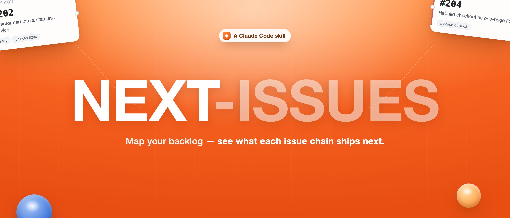
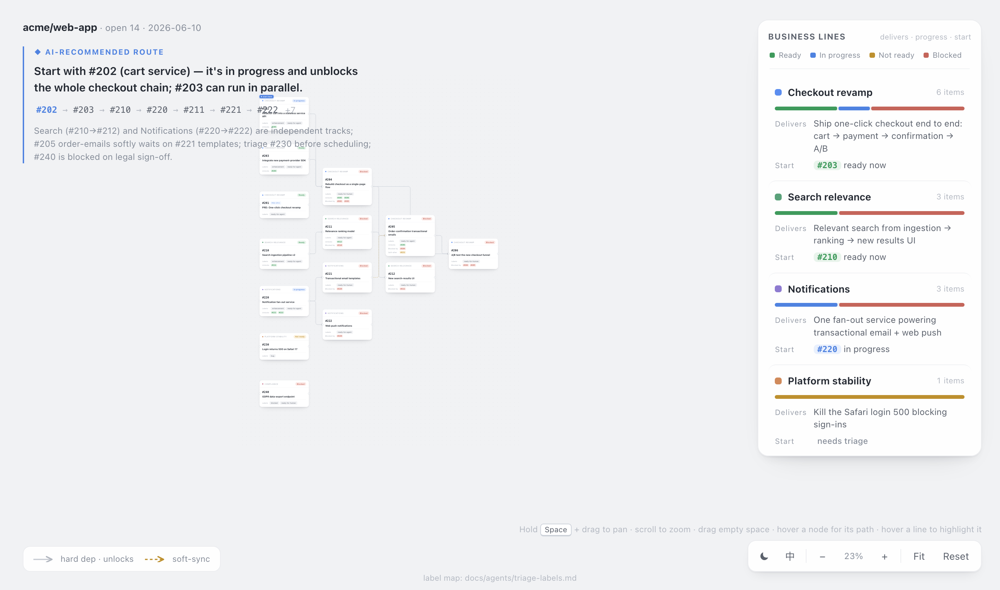
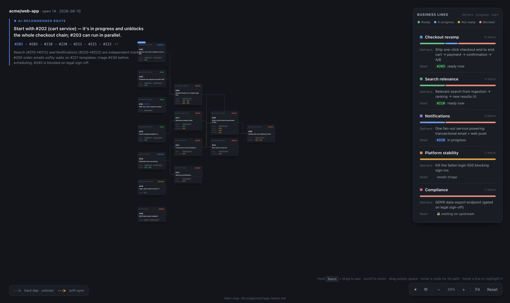
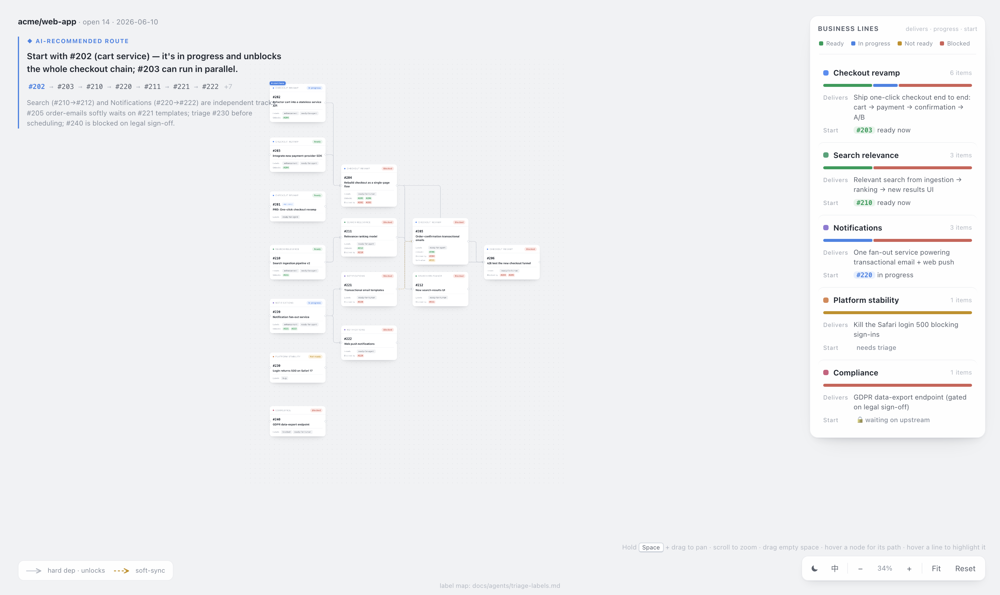

<p align="center">
  
</p>

# next-issue

**A Claude Code skill that turns your repo's open GitHub issues into a clear plan — and draws it as an interactive HTML map.** It surveys the open issues, ranks them by triage state and dependency graph, tells you what to work on next, and renders the whole backlog as a self-contained **business-line & unlock map** you can pan, zoom, and share.

> Following the cables left → right *is* the implementation path. Each node is an issue; each business line is a colour; the side panel spells out **what shipping each line actually delivers**.

---

## 🗺️ The headline: a visual "unlock map", not a list

Ask *"what should I work on next?"* and most tools hand you a flat list. `next-issue` hands you a **workflow-style path graph on an infinite canvas**:

- **Nodes laid out by dependency depth** — root issues on the left, the things they unlock to the right. The connectors are the plan.
- **Orthogonal dependency cables** — solid = hard dependency (`prerequisite → unlocked`), dashed = soft-sync coordination.
- **Restrained, meaningful colour** — status is the only saturated colour (🟢 ready · 🔴 blocked · 🟡 needs-triage · 🔵 in-progress); each business line gets one quiet dot. No confetti.
- **Structured issue cards** — number, title, labels, and grouped `unlocks / blocked-by / soft-after` references.
- **AI recommended route** — a lightweight top-left note with an ordered breadcrumb (`#210 → #211 → …`), plus a **▶ start-here** flag pinned to the top pick on the canvas.
- **Business-line "unlock" panel** — per line: a status progress bar, the **feature it delivers** once complete, and the **next actionable issue** (or what's blocking it).
- **Infinite canvas** — hold <kbd>Space</kbd> + drag to pan, scroll to zoom, *fit* / *reset*; hover a node to light up its full upstream+downstream path, hover a line to highlight the whole chain.
- **Light / dark + English / 中文** — flip theme and UI language right from the toolbar; your choice is remembered.
- **Self-contained** — one HTML file, no network, no build step. Keep it, share it, drop it in a PR.

The point it exists to make: **"finish this chain of issues → ship this feature."**



<sub>Light & dark, English & 中文 — toggled from the toolbar:</sub>



## What else it does

- **Ranks the board** into _ready now_ / _blocked_ / _not-yet-triaged_, with a topologically valid execution order.
- **Dependency-aware ordering** done deterministically in code, not guessed: closed blockers auto-clear, a `Parent: #PRD` link is *grouping* not a dependency, prose "soft sync" notes become ordering hints (not hard blocks), and dependency cycles are detected and surfaced.
- **Clarity gate** — when you commit to an issue, it checks whether the issue is actually specified well enough to execute, and routes fuzzy ones to a clarification pass *before* any code is written. It never silently starts changing code.
- **Works on any repo** — reads your `docs/agents/triage-labels.md` as the single source of truth for triage labels, falling back to five canonical roles.

## How it works

Three layers, splitting deterministic work from judgement:

| Layer | File | Responsibility |
|---|---|---|
| **Data** | `scripts/issue_board.py` | Pulls open issues via `gh`, parses dependencies, computes a ranked, topologically-ordered board as JSON (stdlib only). |
| **Judgement** | _the model_ | Clusters issues into business lines and writes the "complete this line → ships X" copy that a script can't. |
| **Render** | `scripts/render_board.py` + `assets/board_template.html` | Merges the board + annotations into the self-contained HTML map. |

```bash
# 1. pull & rank
python3 scripts/issue_board.py > /tmp/board.json          # or --repo OWNER/NAME

# 2. (the model writes /tmp/annotations.json: business lines + unlock copy + headline)

# 3. render the map
python3 scripts/render_board.py \
  --board /tmp/board.json \
  --annotations /tmp/annotations.json \
  --out /tmp/next-issue-board.html
open /tmp/next-issue-board.html            # xdg-open on Linux
```

Annotations are optional — without them you still get a valid map grouped by label / PRD; with them you get the full unlock story.



## Install

`next-issue` is a Claude Code skill — this repo **is** the skill.

**Option A — download the packaged skill** (easiest): grab `next-issue.skill` from the [latest release](https://github.com/pantsbang-yannik/next-issues/releases/latest) and install it:

```bash
# a .skill is a zip — unpack it into your skills directory
unzip next-issue.skill -d ~/.claude/skills/
```

**Option B — clone the repo** straight into your skills directory:

```bash
git clone https://github.com/pantsbang-yannik/next-issues.git ~/.claude/skills/next-issue
```

Then just talk to Claude Code naturally — *"what should I work on next?"*, *"sort the backlog by priority and dependencies"*, *"draw the issues and business lines as a map"*, *"can I start #204 yet?"* — and the skill triggers. (`~/.claude/skills/` is the usual personal-skills directory; adjust to your runtime.)

## Requirements

- `python3` (standard library only — no pip installs)
- [`gh`](https://cli.github.com/) CLI, authenticated (`gh auth login`)
- A modern browser to open the HTML map

## Benchmarks

Measured against the same tasks on a real repo, **with** the skill vs. an unaided agent doing it from scratch:

| Task | Metric | With skill | Unaided | Δ |
|---|---|---|---|---|
| **Generate the visual map** | tokens | **31.7k** | 46.2k | **−31%** |
| | wall-clock | **107s** | 185s | **−42%** |
| **Analyze & prioritize** (n=3) | issue-understanding accuracy | **100%** | 93% | +7pt |
| | tokens | **39.3k** | 42.7k | −8% |

The big wins are on map generation (the unaided agent hand-builds all the HTML/SVG every time) and on **consistency** — the dependency engine is deterministic, so the same board always produces the same structural classification, and it doesn't slip on traps like *"blocked-by issues are all closed, so it's actually unblocked now"*. <sup>Wall-clock figures come from concurrent runs (treat as ratios/trends); accuracy graded against a fixed factual rubric.</sup>

## License

MIT — see [LICENSE](LICENSE).
